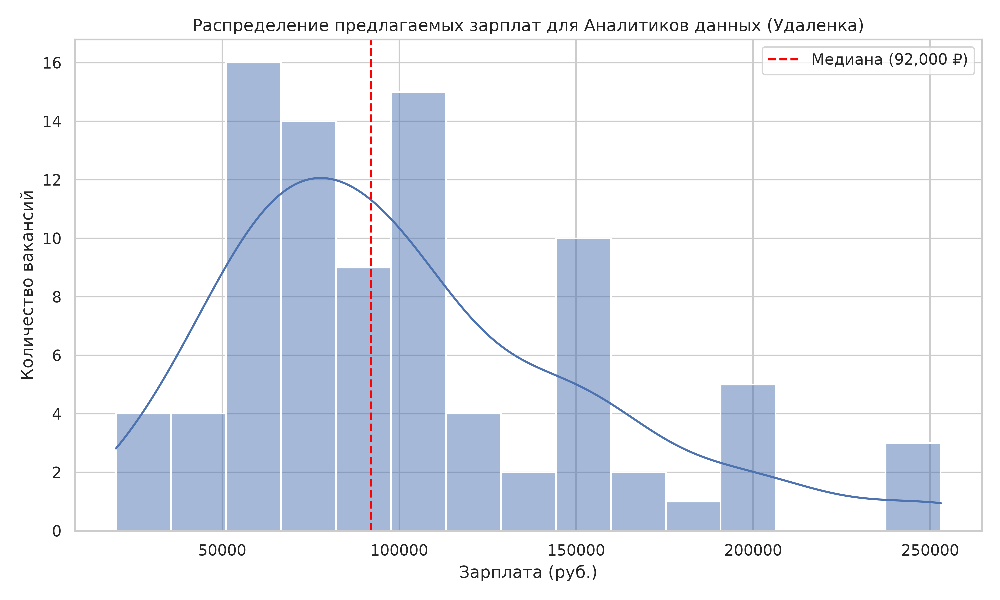
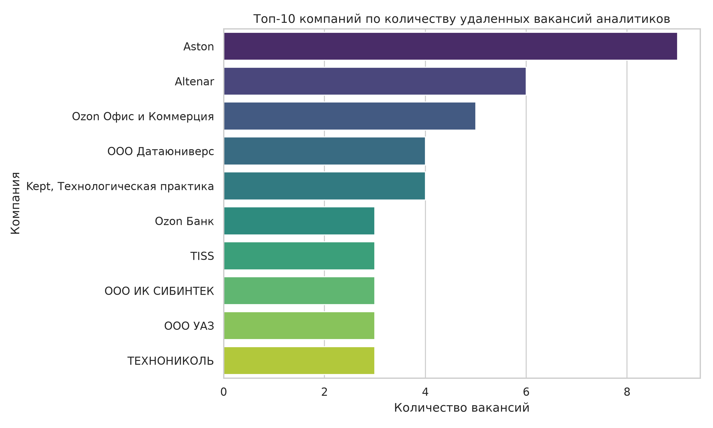

# 📊 Анализ рынка вакансий «Аналитик данных» на hh.ru

Комплексный pet-проект по сбору, очистке и анализу данных о вакансиях для Data Analysts с сайта HeadHunter. 

Проект демонстрирует полный цикл работы с данными (ETL & EDA): от написания асинхронного парсера, обходящего ограничения динамических сайтов, до построения аналитических графиков.

## 🛠 Стек технологий
* **Python 3.10+**
* **Сбор данных (Web Scraping):** `Crawlee` (PlaywrightCrawler), `asyncio`
* **Обработка данных (Data Cleaning):** `Pandas`, `NumPy`, `RegEx`
* **Визуализация (EDA):** `Matplotlib`, `Seaborn`

## ⚙️ Структура проекта
1. `hh_parser.py` — Асинхронный краулер. Использует headless-браузер Chromium для загрузки JS-элементов страницы, собирает карточки вакансий (должность, зарплата, компания, ссылка) и реализует явный переход по страницам (пагинацию).
2. `clean_data.py` — Модуль предобработки. Удаляет дубликаты, фильтрует нерелевантные вакансии по ключевым словам в названии, парсит сырой текст зарплат («от 80 000 до 150 000 руб.») в числовые признаки (`ЗП_От`, `ЗП_До`, `ЗП_Средняя`) с учетом валюты.
3. `data_analysis.py` — Модуль исследовательского анализа (EDA). Рассчитывает базовые статистические метрики и генерирует графики.

## 📈 Ключевые результаты анализа
На основе собранной выборки удаленных вакансий (Junior/Middle по всей России) получены следующие метрики (на момент сбора):
* **Очищенный датасет:** 274 целевых вакансии (после фильтрации шума и менеджеров по продажам).
* **Медианная зарплата:** ~ 92 000 руб.
* **Средняя зарплата:** ~ 102 679 руб.

### Визуализация


*Гистограмма распределения предлагаемых зарплат (с линией медианы).*


*Топ-10 работодателей по количеству открытых удаленных вакансий.*

## 🚀 Как запустить локально

1. Клонируйте репозиторий:
   ```bash
   git clone [https://github.com/Ebu4iy-ej/parcing.git](https://github.com/Ebu4iy-ej/parcing.git)
